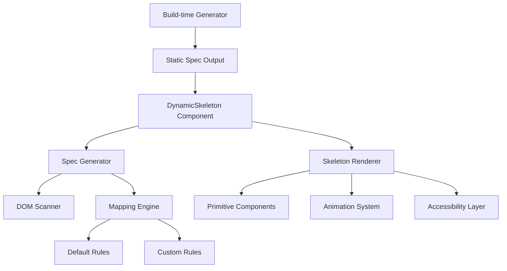

# Design Document

## Overview

The Dynamic Skeleton Loader is a React utility system that automatically generates skeleton UI representations of components through DOM inspection and heuristic mapping. The system consists of three main components: a DOM scanner that analyzes component structure, a mapping engine that converts elements to skeleton primitives, and a renderer that outputs accessible skeleton UI with customizable styling and animations.

The design prioritizes performance through optional build-time spec generation, accessibility through proper ARIA attributes, and flexibility through customizable mapping rules and styling options.

## Architecture

### Core Components



### Data Flow

1. **Input Phase**: Component receives either a React ref for DOM inspection or a precomputed skeleton specification
2. **Analysis Phase**: DOM scanner traverses the element tree and extracts metadata (tag, classes, dimensions, text content)
3. **Mapping Phase**: Mapping engine applies heuristic rules to convert elements into skeleton primitives
4. **Rendering Phase**: Skeleton renderer outputs accessible React components with animations and styling

## Components and Interfaces

### Type Definitions

```typescript
// Core primitive shapes
type SkeletonShape = 'rect' | 'circle' | 'line';

// Individual skeleton element specification
interface SkeletonPrimitive {
  key: string;
  shape: SkeletonShape;
  width?: number | string;
  height?: number | string;
  borderRadius?: string;
  lines?: number; // for line shape only
  style?: React.CSSProperties;
  className?: string;
}

// Complete skeleton specification
interface SkeletonSpec {
  rootKey?: string;
  children: SkeletonPrimitive[];
  layout?: 'stack' | 'grid' | 'row';
  gap?: number | string;
}

// Mapping rule for element conversion
interface MappingRule {
  match: {
    tag?: string;
    classContains?: string;
    role?: string;
    attr?: Record<string, string>;
  };
  to: {
    shape: SkeletonShape;
    size?: { w?: string; h?: string };
    lines?: number;
    radius?: string;
  };
  priority: number;
}

// Main component props
interface DynamicSkeletonProps {
  forRef?: React.RefObject<HTMLElement>;
  renderSpec?: SkeletonSpec;
  mappingRules?: MappingRule[];
  animation?: 'pulse' | 'wave' | 'none';
  theme?: 'light' | 'dark' | { baseColor: string; highlight: string };
  className?: string;
  style?: React.CSSProperties;
  keepSpace?: boolean;
  ariaLabel?: string;
}
```

### DOM Scanner Module

**Purpose**: Traverse DOM tree and extract element metadata for skeleton generation

**Key Functions**:
- `scanElement(element: HTMLElement): ElementMetadata` - Extract metadata from single element
- `buildElementTree(root: HTMLElement, maxDepth: number): ElementMetadata[]` - Traverse tree with depth limit
- `getBoundingInfo(element: HTMLElement): DimensionInfo` - Get computed dimensions and positioning

**Performance Optimizations**:
- Limit traversal to 200 nodes maximum
- Skip elements with zero dimensions
- Use `getBoundingClientRect()` efficiently with batching
- Implement early termination for deeply nested structures

### Mapping Engine Module

**Purpose**: Convert DOM elements to skeleton primitives using configurable rules

**Default Mapping Rules**:
1. Images with "avatar" class → Circle primitive (40px default)
2. Button elements or ".btn" class → Rounded rectangle
3. Heading elements (h1-h6) → Single line primitive
4. Paragraph elements → Multi-line primitive (calculated from text length)
5. SVG/media elements → Rectangle with aspect ratio preservation
6. Small inline elements (.tag, .badge) → Small rectangle primitives

**Rule Processing Algorithm**:
1. Collect all applicable rules for element
2. Sort by priority (highest first)
3. Apply first matching rule
4. Check for `data-skeleton` attribute overrides
5. Fall back to generic rectangle if no rules match

### Skeleton Renderer Module

**Purpose**: Generate accessible React components from skeleton specifications

**Component Hierarchy**:
- `DynamicSkeleton` (main container with accessibility attributes)
- `SkeletonPrimitive` (individual shape renderer)
- `SkeletonLine` (specialized multi-line text renderer)

**Accessibility Implementation**:
- Wrap in `<div role="status" aria-busy="true" aria-live="polite">`
- Include visually hidden loading message
- Disable pointer events and tab navigation
- Provide customizable `aria-label`

## Data Models

### ElementMetadata

```typescript
interface ElementMetadata {
  tagName: string;
  className: string;
  textContent: string;
  dimensions: {
    width: number;
    height: number;
    x: number;
    y: number;
  };
  computedStyle: {
    display: string;
    position: string;
    fontSize: string;
  };
  attributes: Record<string, string>;
  children: ElementMetadata[];
}
```

### SkeletonTheme

```typescript
interface SkeletonTheme {
  baseColor: string;
  highlightColor: string;
  animationDuration: string;
  borderRadius: {
    small: string;
    medium: string;
    large: string;
    circle: string;
  };
}
```

## Error Handling

### DOM Access Errors
- **Issue**: Component ref not available or DOM not mounted
- **Solution**: Graceful fallback to empty skeleton or provided renderSpec
- **Implementation**: Try-catch around DOM operations with fallback rendering

### Performance Degradation
- **Issue**: Large DOM trees causing slow scanning
- **Solution**: Implement node count limits and timeout mechanisms
- **Implementation**: Early termination after 200 nodes or 50ms timeout

### Invalid Mapping Rules
- **Issue**: Malformed custom mapping rules
- **Solution**: Validate rules on input and skip invalid ones
- **Implementation**: Schema validation with detailed error logging

### Missing Dependencies
- **Issue**: React or DOM APIs not available (SSR)
- **Solution**: Detect environment and use appropriate fallbacks
- **Implementation**: Feature detection with graceful degradation

## Testing Strategy

### Unit Testing
- **Mapping Rules**: Verify each default rule produces expected primitives
- **DOM Scanner**: Test element metadata extraction accuracy
- **Primitive Rendering**: Validate component output structure
- **Accessibility**: Confirm ARIA attributes and screen reader compatibility

### Integration Testing
- **End-to-End Flow**: Test complete DOM → skeleton → render pipeline
- **Performance**: Measure scanning time for various tree sizes
- **Cross-browser**: Verify consistent behavior across browsers
- **SSR Compatibility**: Test build-time generation and hydration

### Visual Regression Testing
- **Storybook Integration**: Automated screenshot comparison
- **Animation Testing**: Verify smooth transitions and timing
- **Theme Variations**: Test light/dark themes and custom colors
- **Responsive Behavior**: Validate skeleton scaling across screen sizes

### Performance Testing
- **Scanning Benchmarks**: Measure DOM traversal speed
- **Memory Usage**: Monitor object creation and cleanup
- **Animation Performance**: Verify 60fps animation smoothness
- **Bundle Size**: Track JavaScript payload impact

## Build-time Generation

### Static Spec Generation
For optimal runtime performance, the system supports generating skeleton specifications at build time:

```typescript
// Build-time utility
async function generateStaticSpec(
  component: React.ComponentType,
  props?: any
): Promise<SkeletonSpec> {
  // Use react-test-renderer for shallow rendering
  const renderer = TestRenderer.create(React.createElement(component, props));
  const instance = renderer.getInstance();
  
  // Extract DOM structure from rendered output
  const domTree = renderer.toTree();
  
  // Apply mapping rules to generate spec
  return generateSpecFromTree(domTree);
}
```

### Webpack Plugin Integration
Provide optional webpack plugin to automatically generate specs during build:

```javascript
// webpack.config.js
module.exports = {
  plugins: [
    new SkeletonSpecPlugin({
      components: ['./src/components/**/*.tsx'],
      outputDir: './src/generated/skeletons'
    })
  ]
};
```

This design provides a comprehensive, performant, and accessible solution for automatic skeleton generation while maintaining flexibility for customization and optimization.